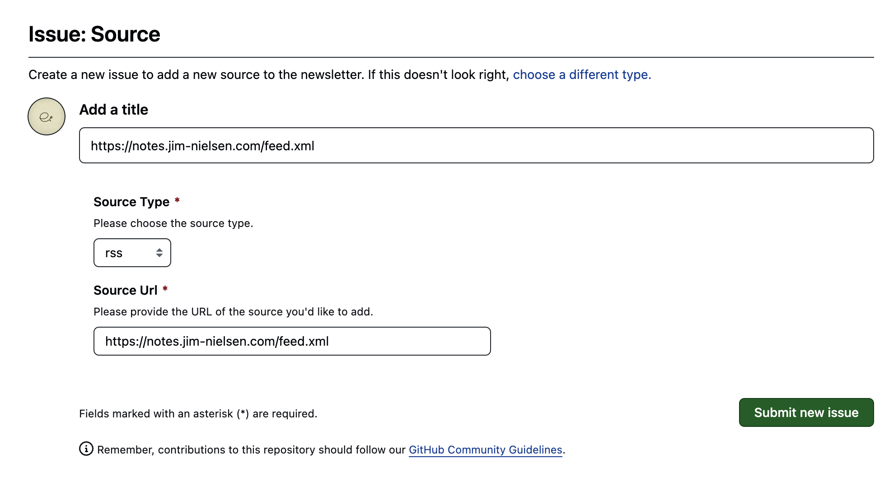

# Newsletter Converter

This repository is a newsletter converter that allows users to post issues with source URLs, such as RSS feeds.
The GitHub workflow runs a cron job every hour to check for new articles and sends them as comments on the same issue, 
ensuring users receive the latest updates in their email.

## Features
- Users can post issues with source URLs for newsletter conversion.
- Automatic delivery of new articles to users' emails.
- Cron job runs every hour to fetch and send new articles.

## How to Use
Copy the source URL you want to subscribe and create a new issue in [here](https://github.com/iFurySt/iNewsletter/issues/new/choose).

That's all!

Now, wait for the cron job to run and send you the latest articles as comments on the same issue. 

Good luck! 🥳
